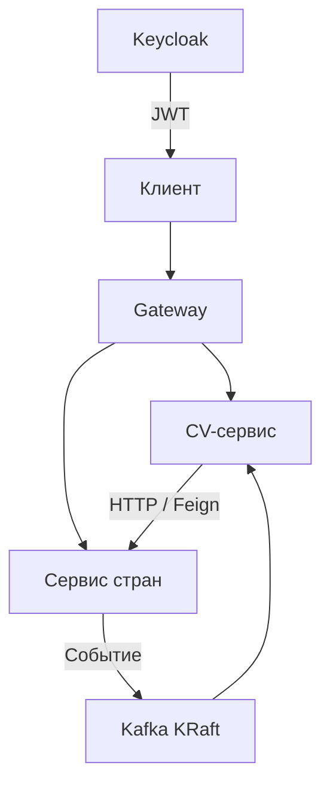

# Gateway, Keycloak и Kafka KRaft

Учебный проект для практики межсервисного взаимодействия: Spring Cloud Gateway, JWT и Keycloak, Eureka, OpenFeign, Spring Cloud Config и Kafka в режиме KRaft.

Исходные эксперименты — **ноябрь–декабрь 2024 года**. В текущей версии примеры объединены в воспроизводимый локальный стенд.

## Что можно проверить

- Получение JWT по `client_credentials` и проверку подписи, срока действия, issuer и audience на Gateway.
- Разграничение доступа: клиент с ролью чтения получает данные, клиент с ролью записи создаёт CV и публикует события.
- HTTP-взаимодействие CV-сервиса с сервисом стран через Feign и Eureka.
- Публикацию события в Kafka, подтверждение отправки и получение события другим сервисом.
- Работу трёх узлов Kafka KRaft с репликацией и `min.insync.replicas`.
- Загрузку настроек из Config Server, retry и circuit breaker при обращении к сервису стран.

## Схема взаимодействия



Eureka используется для обнаружения сервисов. Config Server предоставляет настройки Feign из локальных ресурсов, поэтому запуск не зависит от отдельного GitHub-репозитория с конфигурацией.

## Состав

| Компонент | Назначение | Адрес при запуске через Compose |
| --- | --- | --- |
| `apigateway` | Маршрутизация и проверка JWT/ролей | `http://localhost:8888` |
| Keycloak | Realm `cvs`, два клиента с сервисными аккаунтами | `http://localhost:8080` |
| `eureka-server` | Service discovery | `http://localhost:8761` |
| `CvsAppConfigServer` | Централизованные настройки | `http://localhost:8889` |
| `ms-country` | Справочник стран и Kafka producer | Внутри Docker-сети, порт 8083 |
| `ms-curriculum-vitae` | CV, Feign client и Kafka consumer | Внутри Docker-сети, порт 8084 |
| Kafka | Три узла, broker/controller на каждом | `localhost:9093,9094,9096` |
| `ms-identity` | Отдельное упражнение с BCrypt и собственным JWT | `http://localhost:8085`, профиль `legacy-auth` |

Основной стек: Java 17, Spring Boot 3.3.5, Spring Cloud 2023.0.3, Kafka 3.9.0, Keycloak 26.0.7. Maven- и Gradle-приложения сохраняют свои wrapper-файлы.

## Запуск

Нужны Docker с Compose v2 и Python 3 для вспомогательных скриптов. Для сборки и тестов вне Docker нужен JDK 17.

Из корня репозитория:

```bash
python3 scripts/init-env.py
docker compose up --build -d
docker compose ps
python3 scripts/smoke.py
```

В Windows команды Python можно запускать через `py -3` вместо `python3`.

`init-env.py` создаёт случайные локальные пароли и ключи в `.env`, который исключён из Git. Существующий файл не перезаписывается. Альтернатива — скопировать `.env.example` в `.env` и самостоятельно заменить все значения-заглушки; `JWT_SECRET` должен быть Base64-кодировкой случайного ключа длиной не менее 32 байт.

Первый запуск включает сборку приложений, импорт realm и регистрацию сервисов в Eureka. Скрипт `smoke.py` ждёт готовности Gateway и проверяет полный сценарий, не выводя токены и секреты.

Логи и остановка:

```bash
docker compose logs -f apigateway ms-country ms-curriculum-vitae
docker compose down
```

## Авторизация

В realm `cvs` настроены два confidential client:

| Client ID | Секрет в `.env` | Роли |
| --- | --- | --- |
| `cvs-reader` | `CVS_READER_SECRET` | `cv-read` |
| `cvs-writer` | `CVS_WRITER_SECRET` | `cv-read`, `cv-write` |

Токен выдаётся через `POST http://localhost:8080/realms/cvs/protocol/openid-connect/token` с параметрами `grant_type=client_credentials`, `client_id` и `client_secret`. В запросах к Gateway он передаётся заголовком `Authorization: Bearer <token>`.

Для JWT требуется issuer `http://localhost:8080/realms/cvs` и audience `cvs-api`. Без токена возвращается 401, при недостаточной роли — 403. Адрес JWKS внутри Docker отличается от внешнего issuer; это учтено в настройках Gateway.

Административная консоль Keycloak использует имя `KEYCLOAK_ADMIN` и пароль `KEYCLOAK_ADMIN_PASSWORD` из `.env`.

## API и события

| Метод и путь через Gateway | Результат | Роль |
| --- | --- | --- |
| `GET /cv/1` | CV с названием страны, полученным по HTTP | `cv-read` |
| `POST /cv` | Создание CV; 201 и `Location` с его адресом | `cv-write` |
| `GET /countries/country-id/Russia` | ID страны | `cv-read` |
| `GET /countries/country-name/1` | Название страны | `cv-read` |
| `POST /countries/1/events` | Публикация названия страны; 202 после подтверждения Kafka | `cv-write` |
| `GET /cv/country-events/1` | Последнее событие, полученное CV-сервисом | `cv-read` |

Пример тела `POST /cv`:

```json
{
  "name": "Alex",
  "surname": "Ivanov",
  "countryName": "Russia",
  "city": "Moscow",
  "isReadyToRelocate": false,
  "isReadyForRemoteWork": true,
  "status": "DRAFT"
}
```

UUID генерируется сервером. Неизвестная страна или CV возвращает 404, некорректное тело запроса — 400, недоступность зависимого сервиса или ошибка публикации — 503.

Kafka topic `country-name-topic` имеет три partition, replication factor 3 и `min.insync.replicas=2`. Producer использует `acks=all` и идемпотентность. Ключ сообщения — ID страны, значение — её название. Это позволяет сохранять порядок событий одной страны в одной partition. Подтверждение отправки не означает, что consumer уже обработал событие: чтение `/cv/country-events/{id}` может некоторое время возвращать 404.

## Отдельный пример собственного JWT

```bash
docker compose --profile legacy-auth up --build -d
```

`ms-identity` демонстрирует регистрацию (`POST /auth/register`), проверку пароля и выдачу токена (`POST /auth/token`), а также проверку токена (`GET /auth/validate`, заголовок `Authorization: Bearer <token>`). Регистрация принимает `username`, `email`, `password`; выдача токена — `username`, `password`.

Пароли хешируются BCrypt; повторные username/email возвращают 409. Ключ JWT берётся из `.env`. Эти токены используются только в отдельном упражнении `ms-identity`: основной Gateway принимает токены Keycloak.

## Тесты

```bash
sh scripts/check.sh
```

Проверяются JWT и роли на Gateway, HTTP-контракты и ошибки, создание CV, публикация и получение Kafka-событий, регистрация, хеширование паролей и собственный JWT. Kafka-тесты используют embedded KRaft broker и не требуют Docker или запущенного Keycloak. Полный Compose-сценарий проверяется отдельно через `scripts/smoke.py`.

## Границы учебного стенда

CV, страны и пользователи отдельного JWT-примера хранятся в H2 в памяти и сбрасываются при перезапуске. Проекция полученных событий тоже хранится в памяти; после рестарта её нужно наполнить повторной публикацией событий. Kafka и Keycloak используют именованные Docker volumes.

Стенд рассчитан на локальную практику: опубликованные порты привязаны к `127.0.0.1`, Kafka использует PLAINTEXT, Keycloak запускается в `start-dev`. Три Kafka-узла на одном компьютере позволяют изучать репликацию, но не защищают от отказа самого компьютера.

Realm импортируется только при первом запуске. После изменения секретов в `.env` нужно также обновить их в существующем realm. Для полного сброса учебных данных можно выполнить `docker compose down -v` — команда удаляет Kafka- и Keycloak-volumes.
